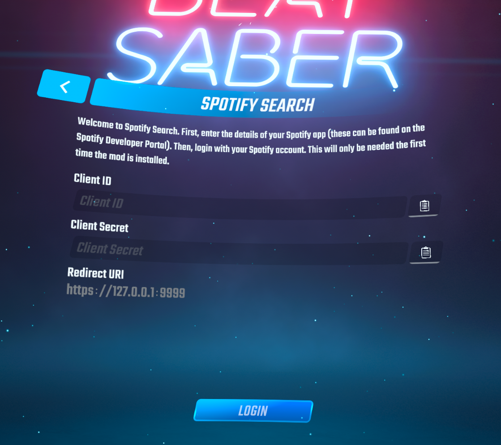
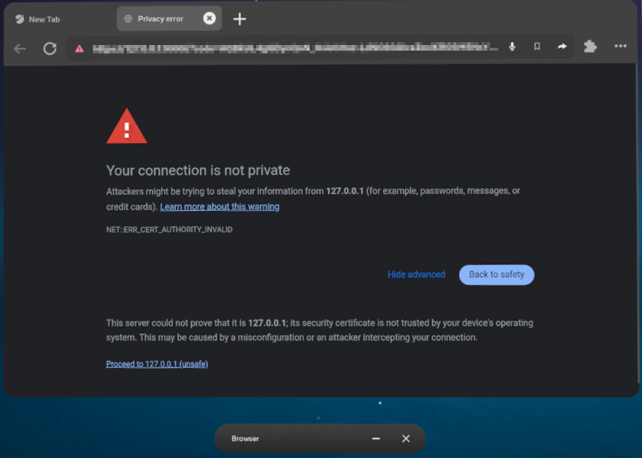
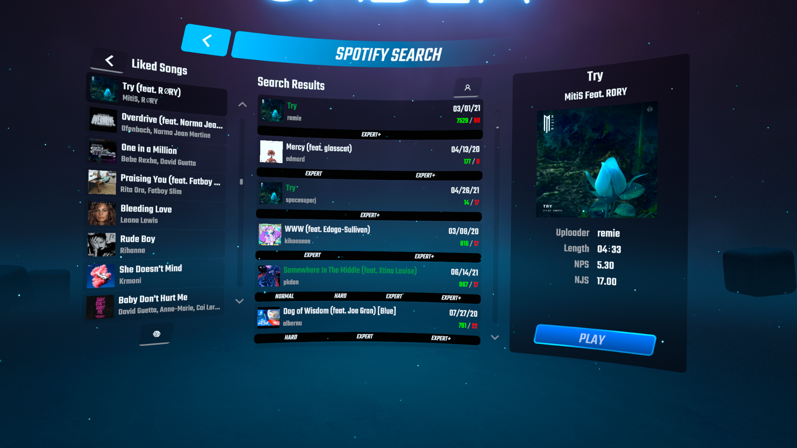

# Beat Saber Spotify Search

A Beat Saber mod for Quest 3 allowing you to access your Spotify playlists from within the game and quickly search for matching custom maps.

## Initial Setup

> ℹ️ Note
>
> Due to Spotify placing limitations on their API, using this mod will require you to create your own "Spotify App" in the Spotify Developer Dashboard. This is free and not too difficult to set up. The steps below will guide you through the process.

### 1. Creating a Spotify App

1. Navigate to the [Spotify Developer Dashboard](https://developer.spotify.com/dashboard).
2. Click "Create app" in the top right corner.
3. Fill out the details for your app. You can use any name and description.
   - Make sure "Redirect URIs" __exactly__ matches `https://127.0.0.1:9999`
   - Make sure "Web API" is checked under "Which API/SDKs are you planning to use?"
4. Once your app is created, find its `Client ID` and `Client Secret` on the details page. Take note of these as they will be needed for the next step.

### 2. Logging in from the mod

1. After installing the mod, you will be presented with a login screen asking for the `Client ID` and `Client Secret` from the previous step. You can type these in manually or open the [Spotify Developer Dashboard](https://developer.spotify.com/dashboard) on the Quest 3 browser and copy/paste them.

2. After clicking Login, the Quest 3 web browser should open and ask you to sign in to Spotify to allow your app to access your account.
> ℹ️ Note
> 
> You will most likely see a warning in the browser stating that this page is unsafe to visit. This is expected because the mod needs to create a local HTTPS server to detect when you successfully logged in. This server uses a self-signed SSL certificate which your device does not trust by default. It's perfectly safe in this case to ignore the warning and click "Proceed to 127.0.0.1" 
> 
>  

### 3. Browse Your Playlists

If all went well, you should now see your playlists in the mod!

### Troubleshooting

#### The browser appears to load forever.

Quit both the browser and the game. Open the browser manually first, then open the game.
